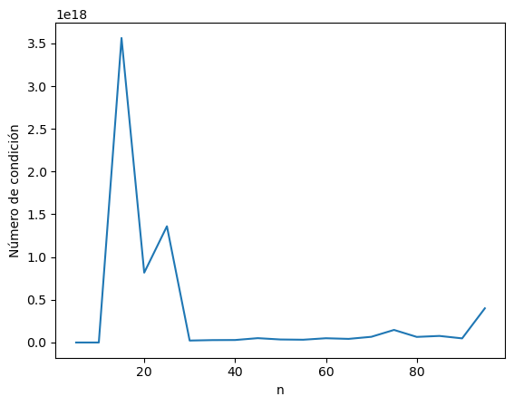
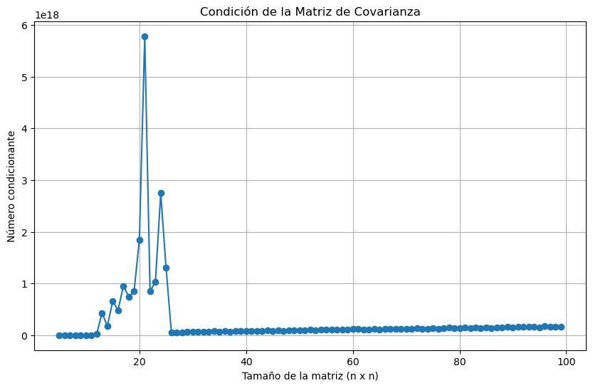
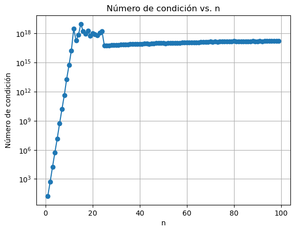

# Taller 2 - Matrices y Sistemas de Ecuaciones

Este repositorio contiene la resolución en Python de los ejercicios propuestos en el Taller 2 para el curso de Álgebra Lineal en Ciencia de Datos de la Universidad EAFIT.

**Autores:**  
- Sebastian Ramirez Escobar
- Sebastian Carvalho Salazar
- Johan Stiven Paez Bermudez

## Descripción de los problemas

### Problema 1
#### Descripción del problema

Un estudiante del curso de álgebra para ciencia de los datos debe realizar cálculos durante tres días en tres procesadores A, B y C. Se proporcionan detalles sobre las horas gastadas en cada procesador y el costo asociado por día. Se busca determinar el precio por hora en cada procesador.

#### Solución
##### Precio por hora en cada procesador

- Procesador A: $40
- Procesador B: $10
- Procesador C: $20

Sin embargo, el estudiante comete un error mínimo en las horas registradas para el procesador A en el tercer día. Se debe analizar cómo este error afecta el valor de la hora en cada procesador y calcular una cota superior para el error relativo.

Output:
Solución: [20. 31.54 10.77]
Solución exacta: [40. 10. 20.]
Solución aproximada: [20. 31.54 10.77]
Error relativo: 0.6723
Cota superior para el error relativo: [[0, 0, 0], [0, 0, 0], [23.02, 0, 0]]

### Problema 2 

Dado un conjunto de datos:

1. Calcular medias y matriz de covarianzas para 4 variables.
2. Demostrar relación entre matriz de datos centrados y matriz de covarianzas.
   #### R// $(ZT * Z) / (n - 1)$ Es la matriz de covarianza
3. Calcular distancias de Mahalanobis de cada observación a las medias.
4. Graficar dispersión de variables coloreando por distancia de Mahalanobis.

#### Análisis de Variables del Conjunto de Datos Pima Indians Diabetes

##### Descripción

Se realiza un análisis sobre el conjunto de datos "Pima Indians Diabetes" con el objetivo de estudiar la relación entre diferentes variables numéricas y calcular distancias específicas entre las observaciones.

##### Procedimiento

1. **Importación de Librerías y Datos:**  
   Se importan las librerías necesarias y se lee el conjunto de datos.

2. **Selección de Variables:**  
   Se seleccionan 4 variables numéricas de interés: `glucose`, `bmi`, `blood_pressure`, y `age`.

3. **Cálculos Estadísticos:**  
   - Se calcula el vector de medias para las variables seleccionadas.
   - Se obtiene la matriz de covarianzas y su inversa.
   - Se centran los datos restando el vector de medias, resultando en la matriz Z.
   - Se calcula el producto de Z transpuesta y Z.

4. **Distancia de Mahalanobis:**  
   Utilizando la librería `scipy`, se calcula la distancia de Mahalanobis de cada observación respecto al vector de medias.

5. **Visualización:**  
   Se realiza una gráfica de dispersión de `glucose` vs. `blood_pressure`, donde el color de cada punto representa su distancia de Mahalanobis.


### Problema 3

#### Algoritmo de Sustitución Hacia Adelante

##### Descripción del problema

El objetivo es implementar el algoritmo de sustitución hacia adelante para resolver el sistema lineal \( Lx = b \), donde \( L \) es una matriz triangular inferior. Si el sistema tiene infinitas soluciones, el algoritmo debe retornar una solución particular y una base para el espacio nulo de \( L \).

##### Solución

Se desarrolló una función `forward_substitution` que toma como argumentos la matriz \( L \) y el vector \( b \). La función sigue los siguientes pasos:

1. Inicializa un vector \( x \) con ceros.
2. Itera sobre cada fila de \( L \).
3. Si el elemento diagonal es cercano a cero, verifica si el sistema tiene solución. En caso de no tenerla, lanza un error. Si tiene solución, genera una base para el espacio nulo.
4. Si el elemento diagonal no es cero, calcula el valor correspondiente de \( x \) utilizando la fórmula de sustitución hacia adelante.

El algoritmo retorna el vector \( x \) si el sistema tiene una única solución. Si tiene infinitas soluciones, retorna una solución particular y una base para el espacio nulo de \( L \).

##### Código

```python
import numpy as np

def forward_substitution(L, b):
    n = L.shape[0]
    x = np.zeros(n)
    null_space_basis = []
    
    for i in range(n):
        if np.isclose(L[i, i], 0):  # Si el elemento diagonal es cercano a cero
            if not np.isclose(b[i], 0):  # Si el término independiente no es cero
                raise ValueError("El sistema no tiene solución.")
            else:  # Generamos una base para el espacio nulo
                null_vector = np.zeros(n)
                null_vector[i] = 1
                null_space_basis.append(null_vector)
        else:
            x[i] = (b[i] - np.dot(L[i, :i], x[:i])) / L[i, i]
    
    if null_space_basis:
        return x, np.array(null_space_basis)
    return x

# Ejemplo de uso
L = np.array([[5, 0, 0],
              [3, 0, 0],
              [1, 3, 7]])
b = np.array([4, 0, 5])

result = forward_substitution(L, b)

if isinstance(result, tuple):
    x_particular, null_basis = result
    print("Solución particular x:", x_particular)
    print("Base del espacio nulo de L:\n", null_basis)
else:
    print("Solución x:", result)
```

---

### Problema 4

1. Simular datos multivariate con matriz de covarianza de Hilbert. Graficar condicionamiento.
2. Ejemplo de sistema mal condicionado con matriz de Hilbert.

#### Análisis de la Matriz de Hilbert y Estimación de la Matriz de Covarianza

##### Descripción del problema

Dada la matriz de Hilbert \( H_n \), se busca simular 1000 datos normales con esta matriz como matriz de covarianza. Posteriormente, se estima la matriz de covarianza a partir de los datos simulados y se grafica el número de condición de la matriz de covarianza estimada en función de \( n \). El objetivo es observar el comportamiento del número de condición y analizar las implicaciones de este comportamiento en la solución de sistemas lineales asociados a la matriz de Hilbert.

##### Solución

1. **Matriz de Hilbert:**  
   Se define una función `hilbert_matrix` que genera la matriz de Hilbert de tamaño \( n \times n \).

2. **Simulación de Datos:**  
   Se simulan 1000 datos normales con matriz de covarianza \( H_n \) usando la función `simulador_datos`.

3. **Estimación de la Matriz de Covarianza:**  
   Se estima la matriz de covarianza a partir de los datos simulados.

4. **Número de Condición:**  
   Se calcula el número de condición de la matriz de covarianza estimada para diferentes valores de \( n \) y se grafica en función de \( n \).

5. **Resolución del Sistema Lineal:**  
   Se resuelve el sistema \( H_{15}x = b \) para un vector \( x \) dado, utilizando diferentes aproximaciones y se comparan los resultados.

##### Código y Resultados

###### Aproximación 1 - Numpy

Se utiliza la librería Numpy para generar la matriz de Hilbert, simular los datos, estimar la matriz de covarianza y resolver el sistema lineal.

```python
import numpy as np
import matplotlib.pyplot as plt

# Funciones y código relacionado...
```

###### Aproximación 2 - SciPy

Se utiliza la librería SciPy para generar la matriz de Hilbert y resolver el sistema lineal, ofreciendo una comprobación de los resultados obtenidos con Numpy.

```python
from scipy.linalg import hilbert, inv, norm

# Funciones y código relacionado...
```

###### Gráfica del Número de Condición vs. \( n \)
###### Aproximación Numpy:

###### Aproximación Scipy:

###### Try,Except (escala logarítmica)


##### Insights

- La matriz de Hilbert es conocida por ser mal condicionada, lo que significa que pequeños cambios en los datos pueden llevar a grandes cambios en la solución.
- A medida que \( n \) aumenta, el número de condición también aumenta, lo que indica que la matriz se vuelve más y más mal condicionada.
- Al resolver el sistema \( H_{15}x = b \), se observan diferencias significativas en las soluciones obtenidas con diferentes métodos, lo que resalta la importancia de elegir métodos numéricos adecuados para matrices mal condicionadas.

## Notebooks

Cada problema tiene un archivo Jupyter Notebook con la resolución en Python utilizando NumPy, Matplotlib, SciPy.

- Punto1_Coeficientes.ipynb
- Punto2_Distancia_Mahalanobis.ipynb 
- Punto3_Sustitucion.ipynb
- Punto4_MatrizHilbert.ipynb

## Ejecución 

Requisitos:
- Python 3
- NumPy
- Matplotlib
- Pandas
- SciPy

Ejecutar cada notebook para ver la resolución detallada de los problemas.