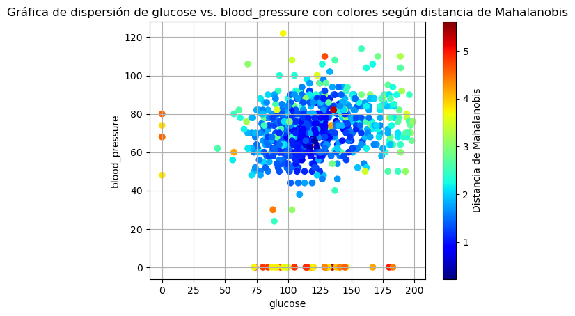

# Taller 2 - Matrices y Sistemas de Ecuaciones

Este repositorio contiene la resolución en Python de los ejercicios propuestos en el Taller 2 para el curso de Álgebra Lineal en Ciencia de Datos de la Universidad EAFIT.

**Autores:**  
- Sebastian Ramirez Escobar
- Sebastian Carvalho Salazar
- Johan Stiven Paez Bermudez

## Descripción de los problemas

### Problema 1
#### Descripción del problema

Un estudiante del curso de álgebra para ciencia de los datos debe realizar cálculos durante tres días en tres procesadores A, B y C. Se proporcionan detalles sobre las horas gastadas en cada procesador y el costo asociado por día. Se busca determinar el precio por hora en cada procesador.

#### Solución
##### Precio por hora en cada procesador

- Procesador A: $40
- Procesador B: $10
- Procesador C: $20

Sin embargo, el estudiante comete un error mínimo en las horas registradas para el procesador A en el tercer día. Se debe analizar cómo este error afecta el valor de la hora en cada procesador y calcular una cota superior para el error relativo.

Output:
Solución: [20. 31.54 10.77]
Solución exacta: [40. 10. 20.]
Solución aproximada: [20. 31.54 10.77]
Error relativo: 0.6723
Cota superior para el error relativo: [[0, 0, 0], [0, 0, 0], [23.02, 0, 0]]

### Problema 2 

Dado un conjunto de datos:

1. Calcular medias y matriz de covarianzas para 4 variables.
2. Demostrar relación entre matriz de datos centrados y matriz de covarianzas.
   #### R// $(ZT * Z) / (n - 1)$ Es la matriz de covarianza
3. Calcular distancias de Mahalanobis de cada observación a las medias.
4. Graficar dispersión de variables coloreando por distancia de Mahalanobis.

#### Análisis de Variables del Conjunto de Datos Pima Indians Diabetes

##### Descripción

Se realiza un análisis sobre el conjunto de datos "Pima Indians Diabetes" con el objetivo de estudiar la relación entre diferentes variables numéricas y calcular distancias específicas entre las observaciones.

##### Procedimiento

1. **Importación de Librerías y Datos:**  
   Se importan las librerías necesarias y se lee el conjunto de datos.

```python
import pandas as pd
import numpy as np
import matplotlib.pyplot as plt
from scipy.spatial import distance
```

2. **Selección de Variables:**  
   Se seleccionan 4 variables numéricas de interés: `glucose`, `bmi`, `blood_pressure`, y `age`.

3. **Cálculos Estadísticos:**  
   - Se calcula el vector de medias para las variables seleccionadas.
   - Se obtiene la matriz de covarianzas y su inversa.
   - Se centran los datos restando el vector de medias, resultando en la matriz Z.
   - Se calcula el producto de Z transpuesta y Z.

4. **Distancia de Mahalanobis:**  
   Utilizando la librería `scipy`, se calcula la distancia de Mahalanobis de cada observación respecto al vector de medias.

5. **Visualización:**  
   Se realiza una gráfica de dispersión de `glucose` vs. `blood_pressure`, donde el color de cada punto representa su distancia de Mahalanobis.



##### Insights

- La gráfica de dispersión muestra la relación entre los niveles de glucosa y la presión sanguínea de los individuos. Los colores indican la distancia de Mahalanobis de cada observación respecto al vector de medias.

### Problema 3

Implementar en Python el algoritmo de sustitución hacia adelante para resolver sistemas de ecuaciones triangulares.

### Problema 4

1. Simular datos multivariate con matriz de covarianza de Hilbert. Graficar condicionamiento.
2. Ejemplo de sistema mal condicionado con matriz de Hilbert.

## Notebooks

Cada problema tiene un archivo Jupyter Notebook con la resolución en Python utilizando NumPy, Matplotlib, SciPy.

- Punto1_Coeficientes.ipynb
- Punto2_Distancia_Mahalanobis.ipynb 
- Punto3_.ipynb
- Punto4_MatrizHilbert.ipynb

## Ejecución 

Requisitos:
- Python 3
- NumPy
- Matplotlib
- Pandas
- SciPy

Ejecutar cada notebook para ver la resolución detallada de los problemas.
